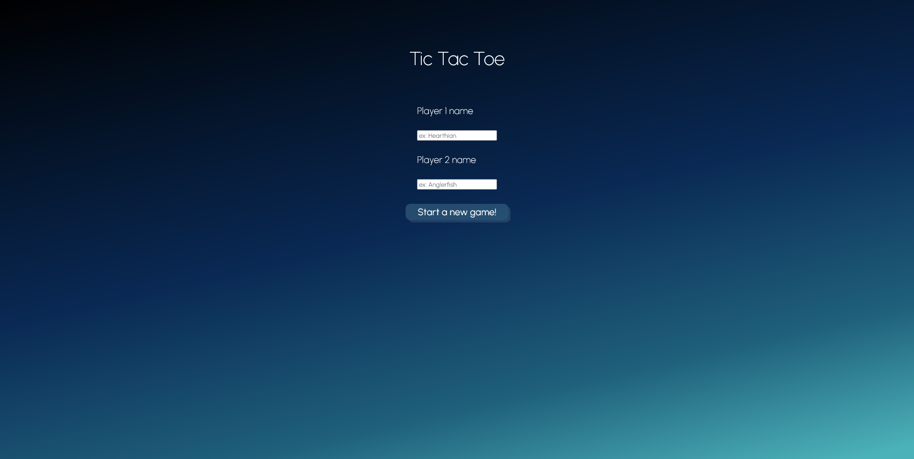
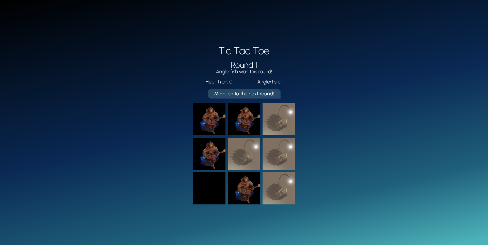
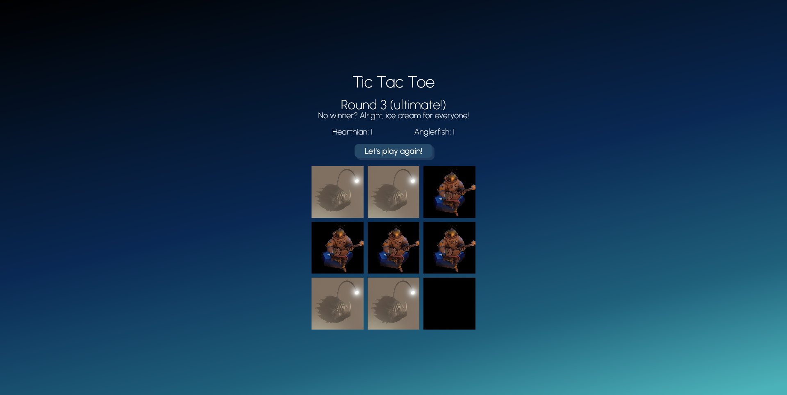
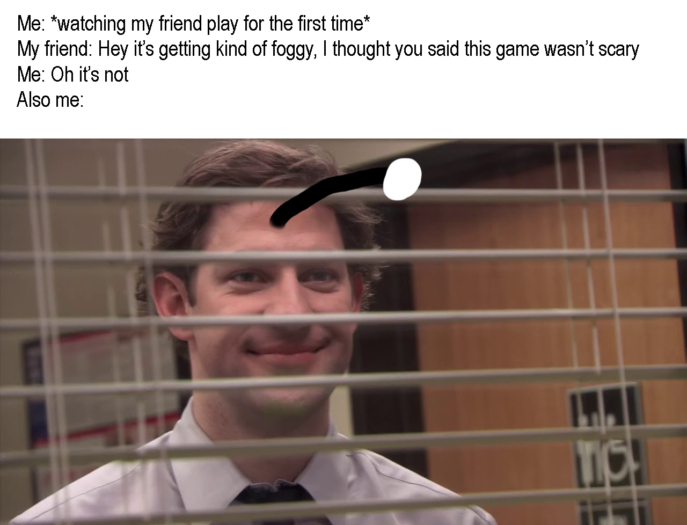

# Tic Tac Toe!

**What?** A two-player game built as part of [The Odin Project](https://www.theodinproject.com/) ([instructions here](https://www.theodinproject.com/paths/full-stack-javascript/courses/javascript/lessons/tic-tac-toe)) using HTML, CSS and JavaScript. Because no AI was built, you will have to play against yourself! ⭕ ❌

**When?** It took me about five days in October 2021 *(3½ months into my coding journey)*.

**Where?** See it live [on GitHub Pages](https://tramio.github.io/TOP-tic-tac-toe/).

## Preview:
Landing page:

After one round:

Once the game is over:

## Challenges:
- This was my first time using factory functions and the module pattern. While getting the hang of the syntax went smoothly, I quickly got the following error: *Uncaught reference error: Cannot access "*[name of a module]*" before initialization*. Concretely: if I want to call a method from my Game module that uses a method from my Page module, I need my Page module to be declared first. But if, in turn, this exact Page method has to call a Game method... How do I arrange my modules, which one goes first? 🐔 🥚

## Notes:
- Yes, this project is ***Outer Wilds*-themed**!

